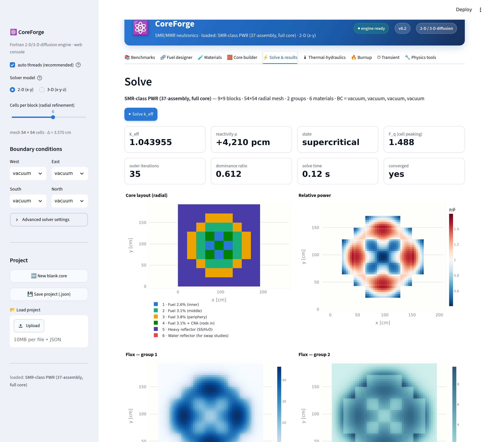
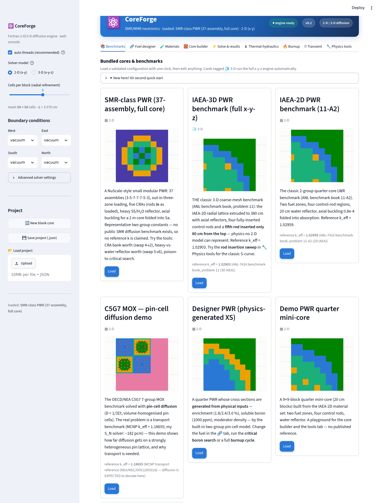

# ⚛️ CoreForge — Interactive 2-D / 3-D Multigroup Reactor Core Simulator

> **SMR/MMR neutronics design & analysis code system.** Türkçe
> dokümantasyon seti (kullanım kılavuzu, teori, doğrulama raporu, akış
> şemaları, örnek çalışmalar) için **[docs/](docs/)** klasörüne bakın.



A **core simulator** in the spirit of production tools (SIMULATE / PARCS
workflow): you build a reactor core interactively in a web UI — materials,
cross sections, loading pattern, boundary conditions — and a **Fortran
multigroup diffusion engine** underneath solves the eigenvalue problem in
**2-D or full 3-D (x-y-z)**, returning k<sub>eff</sub>, flux maps, power
distributions, peaking factors, axial profiles and a full neutron balance.
On top of the flux solver sit a **fuel designer** (enrichment → cross
sections), an **inverse designer** (cross sections → equivalent fuel), a
**block-wise burnup module** with critical-boron letdown and automatic
end-of-cycle detection, control-rod insertion sweeps, criticality searches
and a one-click standalone HTML report.

```
┌──────────────────────────────────────────────────────┐
│  Streamlit UI (app.py)                               │
│  benchmarks · fuel designer · materials · builder    │
│  solve · thermal-hydraulics · burnup · transient ·   │
│  physics tools · project save/load                   │
└──────────────────────────┬───────────────────────────┘
                           │ input.txt          (runner.py)
┌──────────────────────────▼───────────────────────────┐
│  COREFORGE engine (Fortran, solver/coreforge.f90)    │
│  2-D / 3-D multigroup diffusion · red-black SOR ·    │
│  OpenMP · per-layer maps (partially inserted rods)   │
└──────────────────────────┬───────────────────────────┘
                           │ KEFF, balance, flux/power CSV
┌──────────────────────────▼───────────────────────────┐
│  interactive plotly maps · axial profiles · S-curves │
│  letdown curves · burnup maps · HTML report          │
└──────────────────────────────────────────────────────┘
```

## Where CoreForge sits among open tools (gap analysis)

Modern open-source diffusion/nodal core simulators are excellent solvers
but almost all of them are **input-file driven** and stop at the flux
solution. A quick survey of the current landscape:

| tool | solver | UI | fuel cycle | T-H | XS↔fuel bridge |
|---|---|---|---|---|---|
| [KOMODO](https://github.com/imronuke/KOMODO) / [ADPRES](https://github.com/imronuke/ADPRES) | 3-D SANM nodal, static+transient | input files | — | feedback module | — |
| [OpenNode (2024)](https://www.sciencedirect.com/science/article/abs/pii/S0969806X2300587X) | 3-D NEM nodal | desktop Qt GUI | — | — | — |
| [CORE SIM+](https://www.sciencedirect.com/science/article/pii/S0306454921000256) | 2-D/3-D diffusion (noise) | MATLAB scripts | — | — | — |
| [FeenoX](https://www.seamplex.com/feenox/) | FEM diffusion | input files | — | — | — |
| **CoreForge** | 2-D/3-D FDM diffusion | **zero-install web UI** | **burnup + letdown + auto-EOC + multi-cycle reload** | **closed-channel steady state** | **designer + inverse designer** |



What CoreForge adds that the survey did not find elsewhere in one open
package: one-click **validated benchmark presets** with a reproducible
verification suite (`verify.py`), an **interactive fuel-cycle workflow**
(letdown curve, EOC burnup map, cycle length determined by the physics),
the **enrichment ↔ cross-section bridge in both directions**, and 3-D
**rod-insertion S-curve studies** from the browser. It is deliberately
FDM-not-nodal and educational-grade — the gap it fills is *interactivity
+ integration + verifiability*, not raw solver sophistication.

## Competition-spec alignment (Teknofest NDK — simulation code category)

| Şartname maddesi | CoreForge karşılığı |
|---|---|
| SMR/MMR odaklı nötronik analiz kodu | SMR-class 37-assembly kor **varsayılan açılış**; her parametre (zenginlik, geometri, BC, mesh) kullanıcı girdisi |
| Normal işletmede akı, sıcaklık, üretilen enerji sunumu | ⚡ sonuç panelleri + **🔌 Operating point**: MW, W/cm³, n/cm²·s, assembly-MW; transient'te yakıt sıcaklığı |
| Normalden sapmaların **zamana bağlı** hesabı | ⏱ **Point-kinetics kaza dizileri**: rod ejection (RIA) / ramp / scram, **√T Doppler + moderator (MTC)** geri besleme, otomatik **reaktör-koruma trip → scram**, hazır **REA / ATWS / rod-withdrawal** presetleri, $ ve enerji-depozisyonu (cal/g), inhour-doğrulamalı |
| Uluslararası benchmark ile doğrulama | IAEA-2D (−0.5 pcm, Richardson +0.7 pcm order-2), **IAEA-3D (−12.7 pcm, monoton)**, OECD C5G7, 5 analitik vaka — `verify.py` ile 27 otomatik kontrol |
| Dokümantasyon: akış şeması, rehber, örnekler | `docs/AKIS_SEMASI.md` (5 Mermaid şema), `KULLANIM_KILAVUZU.md`, `TEORI_VE_YONTEM.md`, `DOGRULAMA_RAPORU.md`, `ORNEK_CALISMALAR.md` (7 uygulama), `BAGIMSIZ_DOGRULAMA.md`, `YAYINLAMA.md` |
| Uygulama/prototip gösterimi | Canlı web arayüzü + tek dosyalık 📄 HTML rapor + proje kaydet/yükle |

## Physics

Steady-state 2-D/3-D **G-group neutron diffusion** eigenvalue problem:

$$-\nabla\!\cdot\!\big(D_g\nabla\phi_g\big) + \Sigma_{r,g}\,\phi_g
  \;=\; \frac{\chi_g}{k_{\mathrm{eff}}}\sum_{g'}\nu\Sigma_{f,g'}\phi_{g'}
  \;+\; \sum_{g'\neq g}\Sigma_{s,g'\to g}\,\phi_{g'}$$

- mesh-centred finite differences (5-point / 7-point stencil),
  harmonic-mean interface diffusion coefficients;
- per-face boundary conditions on all (4 or 6) faces: *reflective*, or
  **Robin vacuum** $J_\text{out}=\gamma\,\phi_\text{face}$ with
  $\gamma=0.4692$ (transport-corrected; 0.5 = Marshak);
- power iteration + per-group **red-black SOR**, OpenMP-parallel, all
  coefficients precomputed; full $G\times G$ scattering (up-scatter OK);
- 3-D cores use **per-layer material maps**, so partially inserted
  control rods and axial reflectors are represented exactly;
- convergence on both $k$ (10⁻⁷) and the pointwise fission source (10⁻⁵).

## Validation

| case | model | mesh | k_eff | reference | diff |
|---|---|---|---|---|---|
| Homogeneous k∞, all-reflective | 2-D | 8×8 | 1.0857142 | 1.0857143 (analytic) | −0.0 pcm |
| Bare square, 1 group, zero-flux | 2-D | 120×120 | 1.2610188 | 1.2610203 (analytic B²) | −0.1 pcm |
| Bare cube, 1 group, zero-flux | **3-D** | 24×24×24 | 1.2490752 | 1.2489663 (analytic B²) | +3.2 pcm |
| IAEA-2D PWR (ANL 11-A2) | 2-D | 170×170 (h = 1 cm) | 1.0295843 | 1.02959 | −0.5 pcm |
| **IAEA-3D PWR (ANL problem 11)** | **3-D** | 85×85×95 (h = 2, dz = 4) | **1.0288958** | 1.02903 | **−12.7 pcm** |
| C5G7 MOX, pin-cell diffusion demo | 2-D | 102×102 (h = 0.63) | 1.1863920 | 1.18655 (MCNP transport) | −11 pcm * |

IAEA-3D converges toward the reference as the mesh refines (div 2 → 4:
**−34.4 → −12.7 pcm**, monotone) — the full x-y-z benchmark with axial
reflectors, four fully inserted rods and the famous **fifth rod inserted
80 cm from the top** (geometry cross-checked against the official
description; the axial power profile shows the expected top-suppressed
asymmetry, F_z ≈ 1.56). The v8.4 solver uses a **residual-converged
adaptive inner solve**: earlier versions could report `converged` while
the fine-mesh flux was still un-converged, making the refined k drift the
wrong way — now `verify.py`'s `convergence_check` locks in clean
2nd-order (IAEA-2D: order 1.90, Richardson +0.7 pcm). Reproduce
everything:

```bash
python3 verify.py          # 27 checks, ~25 s
python3 verify.py --fine   # adds the fine-mesh rows
```

### Rod insertion S-curve (3-D only physics)

The 🔧 tools tab sweeps rod-5's insertion depth. Measured on IAEA-3D
(h = 10, dz = 17): total rod-5 worth **≈ −980 pcm** with the classic
S-shape — only −85 pcm over the first 85 cm (low-flux top), −476 pcm
through the mid-core flux peak, flattening at the bottom. A 2-D model
cannot even pose this question.

### Verification vs validation — what mesh refinement actually shows

Refining the mesh converges to **the exact solution of the model you are
solving**, not to the reference truth. The C5G7 demo makes this visible:

| h [cm] | k_eff | Δ vs MCNP transport |
|---|---|---|
| 1.260 | 1.184796 | −125 pcm |
| 0.630 | 1.186392 | −11 pcm |
| 0.420 | 1.186721 | +12 pcm |
| 0.252 | 1.186885 | +24 pcm |
| **h→0 (Richardson)** | **1.186984** | **+31 pcm** |

The −11 pcm at h = 0.63 cm is a *coincidence* — negative discretisation
error cancelling the positive model error. As the mesh error vanishes,
the residual **+31 pcm is the honest model error** of homogenised
pin-cell diffusion vs transport. Contrast IAEA-2D/3D, whose references
*are* diffusion solutions: there refinement drives the difference to
zero. Verification vs validation, live.

## Materials: give cross sections OR give fuel — both first-class

Every material is a plain macroscopic set you can type in directly
(benchmark constants, lattice-code output). Materials built in the
🧬 Fuel designer additionally carry a **nuclide composition** — that is
what the burnup module depletes. The bridge between the two worlds is
the **inverse designer**: sequential bisection matches the generated set
to a target's thermal fission and absorption exactly (νΣf₂ → enrichment,
Σa₂ → boron) and reports residuals on everything else. The 1976 IAEA
fuel-1 constants reconstruct to **e = 2.886 w/o + 259 ppm** (νΣf₂/Σa₂
exact, D within ~5 %, Σ₁₂ −17.5 %) — attaching the equivalent makes a
*benchmark* core depletable, clearly labelled as an approximate stand-in.

### The fuel designer (physics inside)

- number densities from real densities and atomic masses;
- **thermal group from true 2200 m/s microscopic data** (U-235 σf 582.6 b,
  σa 680.9 b, ν 2.432; U-238 2.68 b; H 0.3326 b; nat-B 759 b; Pu-239
  1017.9/747.4 b; Xe-135 2.65 Mb; Sm-149 40 kb), scaled by one spectrum
  factor — *relative* nuclide physics is preserved;
- fast group, slowing-down and transport via a handful of semi-empirical
  constants **calibrated once** to a nominal fresh PWR cell and never
  refit — all enrichment/boron/density response comes from the physics.

Checked automatically by `verify.py`: k∞ monotone in enrichment
(1.217/1.320/1.408 at 2.1/3.1/4.5 w/o); boron worth −6.1 pcm/ppm (PWR
band −5…−11); independent-source agreement with the IAEA-2D fuel
constants to better than 25 % on every group constant. **Educational
lattice physics**: trends are physical, absolute k representative — for
production work paste lattice-code constants straight into Materials.

## Burnup — fuel-cycle simulation

Quasi-static depletion the way production core simulators do it: solve
flux → normalise to the specified specific power [W/gU] → integrate the
nuclide chain per block → rebuild cross sections → step. Each burnable
**block carries its own nuclide vector** (U-235/238 → Pu-239/240/241,
equilibrium Xe-135/Sm-149, one calibrated lumped fission-product pair),
optionally with a **critical-boron letdown** each step.

**Auto end-of-cycle:** leave the cycle length blank and the physics
decides — the letdown runs the boron to 0 ppm and the cycle ends when
criticality can no longer be held. Bundled Designer PWR: letdown
1 767 → 0 ppm with k = 1.0000 at every step, then k = 0.990 →
**achievable cycle = 30.0 MWd/kgU = 789 EFPD** (*reactivity-limited*).

| measured quantity | result | literature |
|---|---|---|
| Xe+Sm equilibrium worth (core) | −3 567 pcm | ≈ −2 500…−4 000 |
| boron letdown (15 MWd/kg cycle) | 1 767 → 885 ppm, k = 1.0000 each step | monotone |
| reactivity-limited burnup, 3.1 % (0-D) | 39.7 MWd/kgU | ≈ 28–45 |
| power flattening over cycle | F_xy 2.60 → 1.32 | classic |
| EOC burnup map | core-avg exactly = target | energy bookkeeping |

Honest limits: 2-group frozen spectrum, no Doppler/T-H feedback, no
discrete burnable absorbers, equilibrium-Xe only, depletion is 2-D
(radial) in this version.

## Features

**Engine (`solver/coreforge.f90`, zero dependencies)**
- 2-D and full 3-D (x-y-z) on one code path — NZ=1 *is* the 2-D engine
- arbitrary groups / materials / lattices, full scattering matrix
- per-layer 3-D maps: partially inserted rods, axial reflectors
- keyword input format with comments (documented below)
- power map, peaking F_q with location, per-group neutron balance
- strict input validation, NaN guards, non-convergence warnings

**Web app (`app.py`)**
- 📚 one-click presets, 2-D & 3-D side by side: **IAEA-3D**, IAEA-2D,
  C5G7 MOX (7-group), SMR-class 37-assembly core, Designer PWR,
  mini-core, analytic k∞ — with loading-pattern thumbnails
- 🧬 fuel designer (enrichment/boron/density → XS) + 🔁 inverse designer
- 🧱 **full 3-D core builder**: flip any 2-D core into 3-D (extrude),
  stack/insert/delete/reorder axial zones, per-zone radial maps, copy &
  fill tools, live z-range labels — build ANY x-y-z core from scratch
- 💾 **project save/load (JSON)** + 🆕 blank-core starter — design work
  survives the browser session, shareable as a single file
- ✅ 2-D ↔ extruded-3-D invariance locked in by `verify.py` (the same
  core solved by both paths must agree to < 0.5 pcm)
- ⚡ results: k_eff, Δ vs reference, F_q, **F_z**, axial power profile,
  per-layer flux browser, assembly power map, traverses, balance,
  CSV + 📄 standalone HTML report
- 🔥 block-wise burnup with letdown and **auto end-of-cycle** (EFPD)
- ⏱ **point-kinetics transients & design-basis accidents** (6 delayed
  groups, exact matrix-exponential stepping, inhour-validated) with
  **√T Doppler + moderator (MTC)** feedback, an automatic **reactor-
  protection trip → scram**, canonical **REA / ATWS / rod-withdrawal**
  presets, and $ / prompt-critical / energy-deposition (cal/g) metrics
- ☁️ **xenon transients**: iodine pit depth/time and load-follow peaks,
  anchored to the equilibrium-Xe worth
- 🌡 **closed-channel thermal-hydraulics**: coolant heat-up, clad &
  fuel-centreline temperatures, friction ΔP, saturation margin — for the
  average and the hot assembly, fed by the neutronics power map
- 🔁 **multi-cycle batch reload**: replace the most-burned fraction with
  fresh fuel and march cycle over cycle toward equilibrium
- 🎯 **critical rod position** (3-D): bisect the insertion depth to a
  target k — the axial analogue of the boron search
- 🔌 **operating point**: absolute flux/power-density/assembly-MW from
  the stated core thermal power
- 🔧 tools: material-swap worth, **rod-insertion S-curve (3-D)**,
  critical boron [ppm], generic ΔΣa criticality search
- 🕹 **Live core**: an interactive console for ANY loaded core where
  **control rods move continuously on every core that has them**. A 2-D
  core (SMR, IAEA-2D) is **lifted to an explicit 3-D core** — the axial
  buckling folded into Σa is *unfolded* and replaced by real axial
  reflectors + vacuum ends (the honest 3-D counterpart of the folded
  model; the `buckled` mode is endpoint-exact to the 2-D solve, locked in
  by `verify.py`). Then a **per-layer bank-insertion slider** withdraws
  the CRA depth by depth; IAEA-3D keeps its native **rod-5 depth**;
  designer cores expose **soluble boron / per-fuel enrichment**; plain
  benchmark cores get a **generic absorber**. Every change **re-solves
  the real eigenvalue problem** (fast coarse mesh, fingerprint-cached)
  with instant k_eff, Δρ-vs-baseline, F_xy/F_z, a **3-D assembly-tower
  view** (true fuel height, colour = P/P̄, dark columns = rods at their
  actual insertion depth), an axial rod diagram and a change log.
  Mechanisms live in `livecore.py`; their physics (bank worth +, deeper
  rod ↓k, boron ↓k, enrichment ↑k, lift endpoint-exact) is locked in by
  `verify.py`.
- 🗒️ session run history · 🧵 auto thread selection

## Build & run (WSL / Linux)

```bash
ifx -O3 -qopenmp solver/coreforge.f90 -o solver/coreforge   # Intel oneAPI
# or: gfortran -O3 -fopenmp solver/coreforge.f90 -o solver/coreforge
pip install -r requirements.txt
python3 verify.py              # 27 automated checks (add --fine for more)
streamlit run app.py
```

If the binary is missing, the Python driver **auto-builds** it from
source on first use (tries `ifx`, then `gfortran`; log in
`solver/build.log`) — this is what makes the one-click
**Streamlit Community Cloud** deployment work (`packages.txt` installs
gfortran there). Without any Fortran compiler you can still run the
pure-Python physics subset: `python3 verify.py --no-engine`.

## Publish & live demo

The repo is deployment-ready for Streamlit Community Cloud
(`requirements.txt` + `packages.txt` + engine auto-build). Step-by-step
GitHub publication and cloud-deploy instructions:
**[docs/YAYINLAMA.md](docs/YAYINLAMA.md)**. Ready-to-paste prompts for
having an independent AI (or reviewer) re-run and attack the
verification suite: **[docs/BAGIMSIZ_DOGRULAMA.md](docs/BAGIMSIZ_DOGRULAMA.md)**.

## Direct engine use (no UI)

```text
NG 2                 # energy groups
NX 34
NY 34
NZ 38                # optional (default 1 = 2-D)
DZ 10.0              # required when NZ > 1
DX 5.0
DY 5.0
BC 1 0 1 0 0 0       # W E S N [Bottom Top]: 0 vacuum(Robin), 1 reflective
GAMMA 0.4692         # optional vacuum J/phi (0.5 Marshak)
NMAT 5
MAT 1                # D, SA, NUSF, CHI lines then SCAT matrix (NGxNG)
...
MAP 1 2              # layer range (bottom-based); bare MAP = all layers
<NY rows of NX ids>
MAP 3 28
...
```

Outputs: `KEFF`, `FXY`, convergence info and the neutron balance on
stdout; `flux.csv` and `power.csv` (x, y, z, material, values).

## Scope & honest limits

- **Diffusion** — right for homogenised, smooth-flux cores; pin-level
  heterogeneous transport needs S<sub>N</sub>/MOC (see my
  [C5G7 transport solver](https://github.com/EmreSakarya/c5g7-2d-transport-benchmark),
  −182 pcm vs MCNP).
- FDM, not nodal: fine meshes instead of coarse-mesh polynomials.
- Transients are **point kinetics** (6-group, lumped two-node fuel+
  moderator feedback with √T Doppler and an MTC), not space-time
  kinetics — the spatial flux shape is frozen, so local effects during
  fast transients (e.g. a rod-ejection flux tilt evolving in space) are
  outside scope. The automatic scram uses a statically-computed bank
  worth; decay heat is not modelled.
- T-H is a **closed-channel post-processor** (average + hot assembly);
  the steady-state neutronics is not iterated against coolant/fuel
  temperature (no coupled T-H feedback loop), and boiling is flagged
  via saturation margin, not modelled.
- Burnup is 2-D (radial) only: to deplete a 3-D core, switch it to its
  2-D radial model first (the UI says so if you try); axial burnup
  distribution is roadmap.

## Roadmap

3-D burnup · Wielandt-shifted outers · adjoint & perturbation worths ·
coupled T-H ↔ neutronics feedback iteration · space-time kinetics ·
subchannel T-H.

## License

MIT — see [LICENSE](LICENSE).
