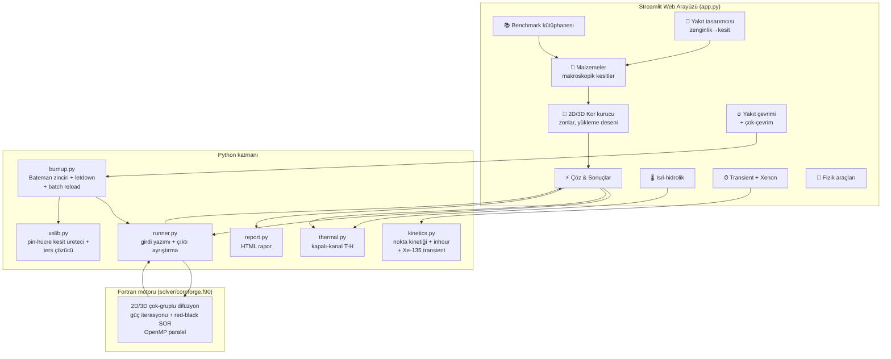
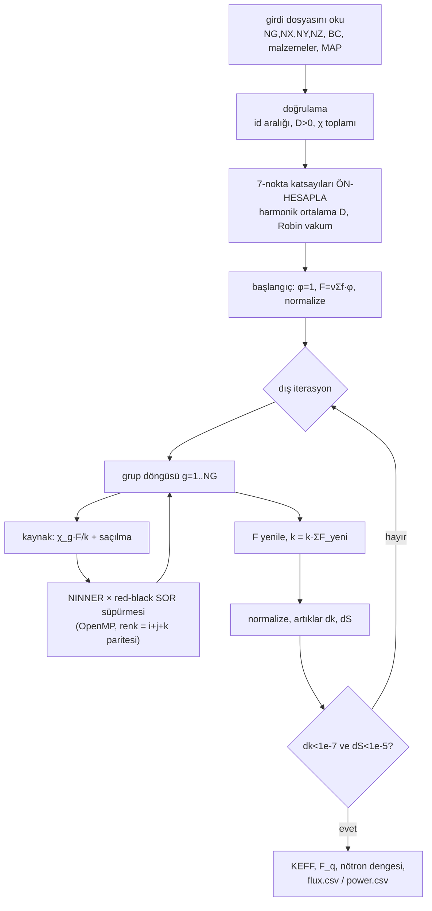
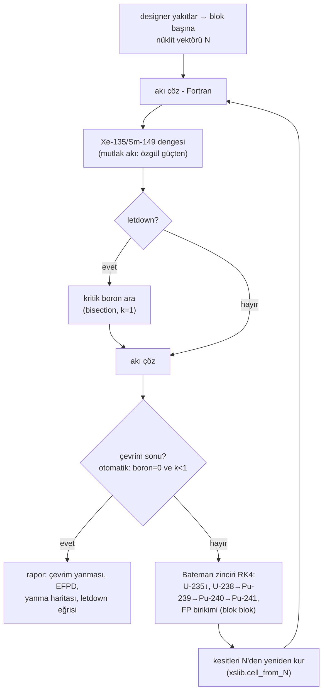
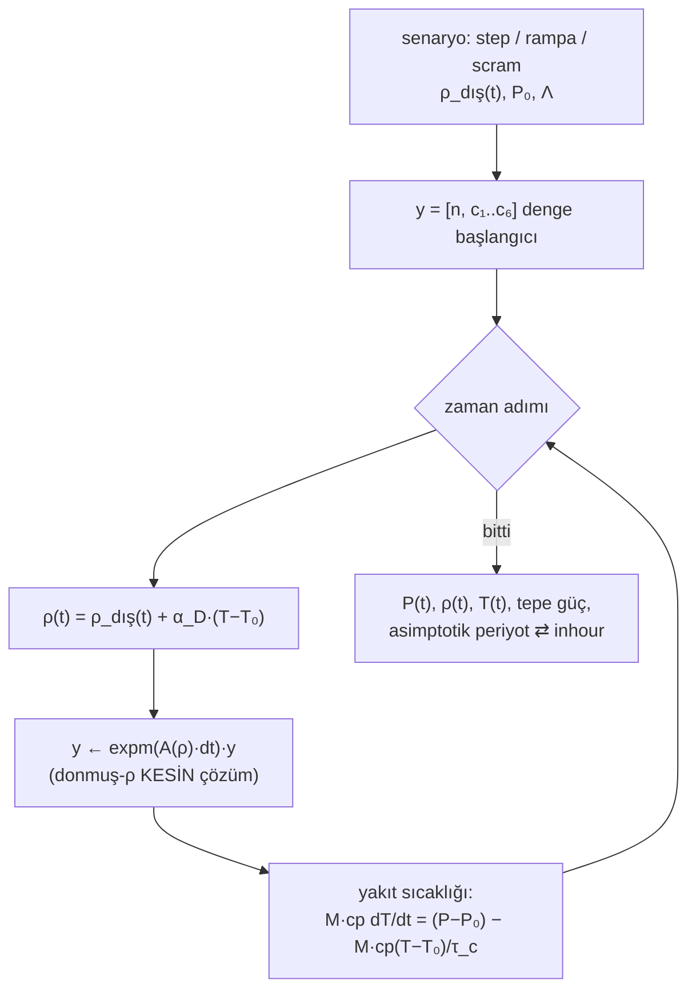
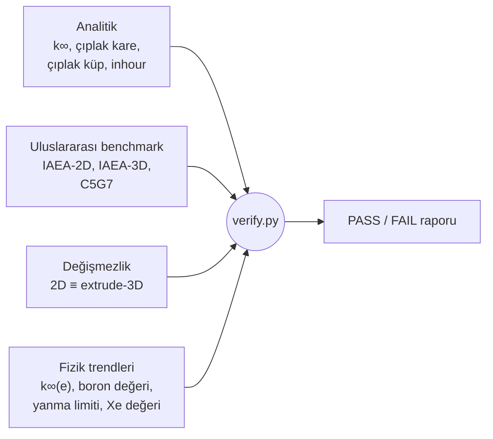

# CoreForge — Akış Şemaları

Bu doküman, kaynak kodun anlaşılmasını kolaylaştırmak amacıyla sistemin
ve ana hesap döngülerinin akış şemalarını içerir (Teknofest NDK
dokümantasyon şartı). Şemalar Mermaid formatındadır; GitHub üzerinde
doğrudan görüntülenir.

## 1 · Sistem mimarisi

## 2 · Fortran özdeğer çözücüsü (bir k_eff çözümü)

## 3 · Yakıt çevrimi (quasi-statik burnup)

## 4 · Transient (nokta kinetiği)

## 5 · Doğrulama zinciri (verify.py — 27 kontrol)

